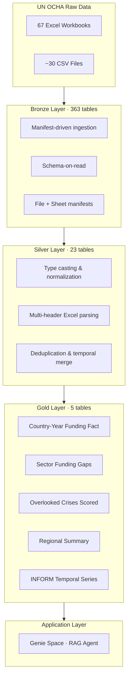

# Geo-Insight: The Overlooked Crises Response Center
## Technical Write-Up

---

## 1. Executive Summary

This project builds a humanitarian funding gap analysis platform on Databricks that identifies "overlooked" crises — situations where high human need coexists with disproportionately low funding. Raw UN OCHA datasets are transformed through a Medallion architecture (Bronze → Silver → Gold) into 5 analytical tables that power a RAG-based conversational agent via Databricks Genie Space. The agent answers natural-language questions such as "which crises are most overlooked?" and "show me food security hotspots with <10% funding." along with appopriate data visualizations.

---

## 2. Problem Statement

Humanitarian funding decisions are fragmented across multiple UN OCHA data systems — FTS (Financial Tracking Service), INFORM Severity Index, HPC (Humanitarian Programme Cycle), and CERF/CBPF allocations. No single interface synthesizes these signals to answer:

- Which crises receive funding far below their stated need?
- Are these gaps persistent (multi-year) or acute?
- Which sectors within a crisis are most neglected?
- Is the severity trajectory worsening while funding stagnates?

Manual analysis of these questions requires joining 10+ datasets with inconsistent schemas, conflicting naming conventions, and structural gaps. Analysts must repeat this work for each query, with no institutional memory of prior answers.

---

## 3. Goal

Given a query or geographic scope:
- Identify relevant crises or countries using severity and needs data
- Filter to situations meeting a meaningful threshold of documented need
- Interpret funding coverage data to compute a gap or mismatch score
- Rank the crises by how overlooked they appear, relative to need

---

## 4. Target Users

- **Humanitarian analysts** (UN agencies, NGOs) — identifying underfunded crises for advocacy
- **Donor strategy teams** — allocating funds where gaps are largest relative to severity

---

## 5. Given Data

**Source:** UN OCHA public datasets, provided as a shared Unity Catalog Volume (`/Volumes/cmu_hackathon/common/unocha/`).

| Category | Files | Format | Coverage |
| --- | --- | --- | --- |
| FTS Requirements & Funding | 9 CSV variants | CSV | 2000–2026, global + cluster-level |
| INFORM Severity Index | 67 monthly workbooks | Excel (.xlsx) | Oct 2020 – Apr 2026 |
| HPC Humanitarian Needs Overview (HNO) | 3 yearly files | CSV | 2024–2026 |
| CERF/CBPF Allocations | 9 CSV files | CSV | Multi-year |
| COD Population | 5 admin-level files | CSV | Latest census/estimate |
| Humanitarian Response Plans | 1 CSV | CSV | Multi-year |
| Country & Territory Taxonomy | 1 Excel workbook | Excel | Reference |
| INFORM Crisis Registry | 1 Excel sheet | Excel | 127 active crises |

**Total raw files:** 67 Excel workbooks + ~30 CSVs → ingested into **363 bronze tables** (Excel sheets exploded into individual tables).

### External Reference Datasets

Two external datasets were ingested separately to resolve structural join gaps in the OCHA data:

| Dataset | Source | Purpose | Silver Table |
| --- | --- | --- | --- |
| Countries & Territories Taxonomy | [HDX](https://data.humdata.org/dataset/countries-and-territories) | Authoritative ISO3 → country name, region, sub-region, coordinates, income level mapping. Used as fallback for country name resolution and as the canonical region assignment across all gold tables. | `njyoti_silver_unocha_country_territory_taxonomy` |
| HPC Global Cluster Taxonomy | [HPC API](https://api.hpc.tools/v1/public/global-cluster) | Bridge table mapping cluster codes ↔ cluster IDs ↔ canonical cluster names (22 rows). Resolves the HNO→FTS sector join — HNO reports sectors by code/free-text while FTS reports by cluster ID. This bridge raised the sector match rate from 67% to 95.4%. | `njyoti_silver_unocha_hpc_global_cluster_taxonomy` |

Both were ingested directly as silver-layer reference tables (no bronze stage) since they arrived already clean and typed from their respective APIs/downloads.

---

## 6. Solution Design

### 6.1 Technical Architecture



### 6.2 Bronze Layer

**Strategy:** Manifest-driven bulk ingestion. A file manifest catalogs all source files; a sheet manifest enumerates every Excel sheet. Ingestion logic:

- **CSV files:** Grouped by dataset classification (regex on filename), unioned into one table per logical dataset. 9 source file groups → 18 bronze tables.
- **Excel files:** Each sheet extracted as an independent table. 67 workbooks × ~7 sheets each → 7 union tables (post-rebrand INFORM) + ~168 stage tables (pre-rebrand GCSI, excluded from downstream processing).
- **Exclusions validated empirically:** GCSI-era tables (2019–2020) excluded after confirming they are strict subsets of the post-rebrand data. COVID-specific FTS variant confirmed as a column-subset of global FTS.

**Key challenge:** 4+ hour serial ingestion for Excel sheets (pandas ExcelFile → Spark DataFrame per sheet).

### 6.3 Silver Layer

23 cleaned, typed, join-ready tables. Transformations organized by structural pattern:

| Phase | Tables | Key Challenge |
| --- | --- | --- |
| INFORM Severity (7 tables) | Multi-row headers, 67-release pivot columns, schema drift across monthly snapshots | Generalized header extraction (Pattern A/B/C detection) |
| FTS Funding (4 tables) | String-typed USD amounts, union of global/cluster/COVID variants | Type casting, deduplication |
| HPC HNO (3 tables) | HXL tag rows embedded as data, sector codes vs. free-text names | Tag-row removal, numeric casting |
| Allocations, COD, HRP, Taxonomy | Straightforward type normalization | Consistent iso3/year join keys |

**Deduplication highlight:** INFORM temporal data reduced from 251,008 rows to 6,889 rows (each monthly snapshot contained full history — only the latest value per crisis×month retained).

### 6.4 Gold Layer

5 purpose-built analytical tables optimized for agent query routing:

| # | Table | Grain | Rows | Purpose |
| --- | --- | --- | --- | --- |
| T1 | `country_year_funding` | iso3 × year | 1,120 | Workhorse fact table — funding, severity, population, allocations |
| T2 | `sector_funding_gaps` | iso3 × year × sector | 668 | Sector-level needs vs. actual funding (24 countries, 2024–2026) |
| T3 | `overlooked_crises_scored` | iso3 × year | 377 | Composite ranked scorecard |
| T4 | `regional_summary` | region × year | 112 | Pre-aggregated regional trends |
| T5 | `inform_temporal_series` | crisis_id × year_month | 6,889 | Severity trajectory for drill-down |

**Sources joined in T1:** FTS + HRP + INFORM Severity + INFORM Trends + COD Population + CERF/CBPF Allocations + Crisis Registry + Country & Territory Taxonomy.

**Column comments applied** across all gold tables for Unity Catalog discoverability (54 comments total).

---

## 7. Overlooked Scoring Methodology

The `overlooked_score` is a **multiplicative composite** — all six components must be non-zero for a high rank. This enforces that truly overlooked crises sit at the intersection of severity, funding gap, scale, trend, persistence, and allocation neglect.

### Formula

```
overlooked_score = severity_norm
                 × funding_gap_norm
                 × scale_norm
                 × trend_multiplier
                 × persistence_multiplier
                 × allocation_neglect
```

### Components

| Component | Formula | Range | Interpretation |
| --- | --- | --- | --- |
| `severity_norm` | INFORM index / 5.0 | [0, 1] | Higher = more severe humanitarian conditions |
| `funding_gap_norm` | CLAMP(1 − pct_funded/100, 0, 1) | [0, 1] | Higher = larger shortfall relative to ask |
| `scale_norm` | CLAMP((log10(requirements) − 5) / 5, 0, 1) | [0, 1] | Higher = larger absolute dollar need |
| `trend_multiplier` | Increasing=1.3, Stable=1.0, Decreasing=0.8 | [0.8, 1.3] | Amplifies worsening crises |
| `persistence_multiplier` | 1.0 + (years_below_threshold / 5) × 0.5 | [1.0, 1.5] | Amplifies chronic underfunding |
| `allocation_neglect` | 1 − MIN(1, allocations/requirements) | [0, 1] | Higher = less CERF/CBPF coverage |

### Calibration

- **Underfunded threshold:** 33% — empirically calibrated from P25–P33 band of `fts_percent_funded` distribution (n=1,052 valid rows). Below this threshold, a country-year is counted toward `years_below_threshold`.
- **Persistence lookback:** 5 years.
- **Ranking:** `DENSE_RANK()` partitioned by year, ordered by `overlooked_score DESC`.

### Validation

- **Discrimination:** P90/P10 ratio = 6.5× (sufficient spread for meaningful ranking)
- **Face validity:** 7 of 8 known severe crises appear in top 20 (AFG, YEM, SSD, COD, SOM, SYR, MMR)
- **Edge case:** PRK ranks 8th but has `inform_tracked=FALSE` — score is directionally valid but relies on FTS-only components

---

## 8. RAG Agent Design

The application layer uses **Databricks Genie Space** — a managed RAG agent that translates natural-language questions into SQL against the gold layer, executes them, and returns formatted answers.

### How Genie Space Functions as a RAG Agent

Genie Space is a text-to-SQL system underpinned by retrieval-augmented generation. Its architecture includes:

- **Vector search over table/column metadata:** Table descriptions, column comments, and synonyms are embedded and indexed. When a user asks a question, the system performs semantic retrieval over this metadata to identify relevant tables and columns before generating SQL. This is the core RAG retrieval step — the "knowledge base" is the structured metadata of the gold layer.
- **Entity matching (fuzzy value resolution):** Categorical column values (country names, regions, sectors, trend labels) are pre-indexed for approximate matching against user input. A query like "show me Sudan" resolves to `iso3='SDN'` without requiring exact string matches. This is implemented via indexed value lists on 12 columns across the 5 tables.
- **Instruction-guided SQL generation (few-shot context):** Text instructions, SQL examples, join snippets, and filter snippets are retrieved and injected as context into the SQL generation prompt. This functions identically to few-shot prompting in a traditional RAG pipeline — the retrieved "documents" are curated SQL patterns rather than unstructured text.
- **Guardrail injection:** Conditional caveats are attached to responses based on which tables/columns are referenced. For example, any response referencing T3 includes a note about the 43.2% unscored universe. This is rule-based post-processing, not LLM-generated.

### What Was Configured (Iterative, Evaluation-Driven)

#### Phase A — Foundation

| Configuration | Count | Purpose |
| --- | --- | --- |
| Table descriptions | 5 | Grain, scope, row count, example queries per table |
| Column synonyms | 47 | Map business terms → column names (e.g., "shortfall" → `funding_gap_usd`) |
| Entity-matched columns | 12 | Pre-indexed categorical values for fuzzy resolution |
| Starter questions | 8 | Seed the interface with representative query patterns |
| Hidden columns | 5 | Remove internal/join-key columns from agent view |
| General instructions | 1 block | 6 conditional caveats + query routing guidelines |

#### Phase B — Evaluation-Driven Structural Improvements

**Methodology:** 10 realistic user questions generated, translated to expected SQL, executed, and evaluated blind on Relevance, Accuracy, and Correctness (1–5 scale). Baseline average: 4.17/5. Two critical failures identified (Q5: 3.3, Q8: 2.3) — both caused by incorrect join patterns (fan-out from undeduplicated temporal data, INNER JOIN dropping 90% of countries from sector drill-down).

**Fixes applied:**

| Configuration | Count | Purpose |
| --- | --- | --- |
| Text instructions | 8 | Cross-table join rules, NULL semantics, temporal scope, response pattern |
| SQL examples | 4 | LEFT JOIN T3→T2, deduplicated T5→T1, compound filters |
| Join snippets | 4 | Declared relationships with cardinality and required join type |
| Filter snippets | 3 | Reusable WHERE clauses for common constraints |
| Derived measures | 3 | Human-readable aggregations (billions, totals, averages) |
| Additional synonyms | 6 | Crisis context terms (drivers, crisis count, crisis name) |

#### Phase C — Benchmarking

All 10 evaluation questions added as benchmarks with expected SQL. Post-improvement scores measured and instructions iterated based on failure analysis.

#### Phase D — Negative Testing

Off-topic messages tested (unrelated domains, prompt injection attempts). Genie handled them gracefully — restated its purpose and declined to engage.

### Query Routing Logic

| Query Pattern | Primary Table | Drill-Down |
| --- | --- | --- |
| "Most overlooked crises" / ranking | T3 | T5 (trajectory), T2 (sector) |
| "Country X funding gap" | T1 | T2 (sector breakdown) |
| "Food security / WASH hotspots" | T2 | T1 (country context) |
| "Which region most underfunded" | T4 | T1 (country detail) |
| "Has crisis X been getting worse" | T5 | T3 (score rank) |
| "Conflict-driven vs climate-driven" | T3 | T1 (funding) |
| "Underfunded for years" | T3 | T1 (history) |

---

## 9. Assumptions

| ID | Assumption | Impact |
| --- | --- | --- |
| A1 | FTS requirements = stated humanitarian need | Politically constructed; over/under-appeal possible |
| A2 | Absence from INFORM ≠ absence of crisis | 17 countries scored via FTS-only components |
| A3 | COD population uses `population_group="T_TL"`, `gender="all"`, `admin_level=0` | Single static figure per country (no year dimension) |
| A4 | `fts_percent_funded` = same-plan funding only | Bilateral and private aid excluded |
| A5 | HNO sector data covers 2024–2026 only | Scoring most reliable for 2020+ |
| A6 | INFORM 2026 scale change (1–10 → normalized ÷2) | Introduces uncertainty in 2026 cross-year comparisons |
| A7 | Multiplicative score design | All components must be non-zero; single missing factor zeroes the score |

---

## 10. Known Gaps & Limitations

### Data Coverage Gaps

| Gap | Impact | Mitigation |
| --- | --- | --- |
| 43.2% of FTS requirements are unscored | T3 covers 377/1,120 country-years (~57% of dollar requirements) | Agent caveats scoring universe in responses |
| 17 ISO3 codes untracked by INFORM | `severity_norm` absent; scores directionally valid but not directly comparable | `inform_tracked` boolean + guardrail instruction |
| Bilateral aid excluded from `fts_percent_funded` | Real funding coverage may be higher than reported | Agent caveat on all funding gap responses |
| CERF/CBPF allocations cover 35% of scored rows | `allocation_neglect` defaults to 1.0 (max neglect) for 65% | Documented bias; future data enrichment needed |

### Structural Limitations

| Limitation | Detail |
| --- | --- |
| Sector match: 66.8% overall | GBV, Child Protection, HLP, Mine Action = 0% (reported under parent "Protection" in FTS) |
| WASH sector: 57% match | Partial FTS cluster name alignment |
| Static population denominator | No temporal population growth adjustment |
| 2026 data provisional | Both INFORM severity and FTS funding are partial-year |

### Agent Limitations

| Limitation | Detail |
| --- | --- |
| Single-turn only | No multi-turn memory; each question is independent |
| SQL-only answers | Cannot synthesize qualitative OCHA narrative reports |
| No real-time data | Gold layer is a point-in-time snapshot; no streaming refresh |

---

## 11. Future Scope

These items could be implemented as an extention to this effort.

- **Lakeview Dashboard:** Donor-facing visual layer for human validation independent of the agent
- **Vector Search over OCHA situation reports:** Ingest qualitative reports to enable synthesis beyond structured data
- **Alternative severity sources:** ACAPS, FEWS NET to fill INFORM gaps for the 17 untracked countries
- **Streaming refresh:** Scheduled pipeline to ingest monthly INFORM releases and FTS updates
- **Supervisor + multi-agent architecture:** For advanced workflows that Genie alone cannot handle requiring complex multi-table synthesis queries via orchestration across multiple retrieval steps

---

## 12. Project Artifacts

| Artifact | Location |
| --- | --- |
| Ingestion notebook | `Ingestion_to_bronze` |
| EDA notebook | `UNOCHA Bronze EDA_v2` |
| Silver transformations | `Bronze_transformations` |
| Gold layer + validation | `Gold_layer` |
| RAG configuration log | `UNOCHA Notes and RAG Approach` |
| Genie Space* | UNOCHA Humanitarian Funding Gap Analysis (ID: `01f1565ae8131dd19ee95ddc6c88dbb1`) |
| Catalog/Schema | `workspace.default` |
| Table prefixes | `njyoti_bronze_unocha_*`, `njyoti_silver_unocha_*`, `njyoti_gold_*` |

* Link to Genie Space: https://dbc-a9bb8112-eab1.cloud.databricks.com/genie/rooms/01f1565ae8131dd19ee95ddc6c88dbb1?o=7474646980615929