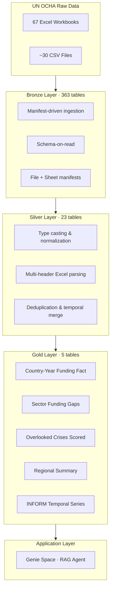

# Geo-Insight: The Overlooked Crises Response Center
[GitHub Repo](https://github.com/nj026/Geo-Insight-The-Overlooked-Crises-Response-Center.git)
## Technical Write-Up

---

## 1. Executive Summary

This project builds a humanitarian funding gap analysis platform on Databricks that identifies "overlooked" crises — situations where high human need coexists with disproportionately low funding. Raw UN OCHA datasets are transformed through a Medallion architecture (Bronze → Silver → Gold) into 5 analytical tables that power a RAG-based conversational agent via Databricks Genie Space. The agent answers natural-language questions such as "which crises are most overlooked?" and "show me food security hotspots with <10% funding." along with appropriate data visualizations.

---

## 2. Problem Statement

Humanitarian funding decisions are fragmented across multiple UN OCHA data systems — FTS (Financial Tracking Service), INFORM Severity Index, HPC (Humanitarian Programme Cycle), and CERF/CBPF allocations. No single interface synthesizes these signals to answer:

- Which crises receive funding far below their stated need?
- Are these gaps persistent (multi-year) or acute?
- Which sectors within a crisis are most neglected?
- Is the severity trajectory worsening while funding stagnates?

Manual analysis of these questions requires joining 10+ datasets with inconsistent schemas, conflicting naming conventions, and structural gaps. Analysts must repeat this work for each query, with no institutional memory of prior answers.

---

## 3. Goal

Given a query or geographic scope:
- Identify relevant crises or countries using severity and needs data
- Filter to situations meeting a meaningful threshold of documented need
- Interpret funding coverage data to compute a gap or mismatch score
- Rank the crises by how overlooked they appear, relative to need

---

## 4. Target Users

- **Humanitarian analysts** (UN agencies, NGOs) — identifying underfunded crises for advocacy
- **Donor strategy teams** — allocating funds where gaps are largest relative to severity

---

## 5. Given Data

**Source:** UN OCHA public datasets, provided as a shared Unity Catalog Volume (`/Volumes/cmu_hackathon/common/unocha/`).

| Category | Files | Format | Coverage |
| --- | --- | --- | --- |
| FTS Requirements & Funding | 9 CSV variants | CSV | 2000–2026, global + cluster-level |
| INFORM Severity Index | 67 monthly workbooks | Excel (.xlsx) | Oct 2020 – Apr 2026 |
| HPC Humanitarian Needs Overview (HNO) | 3 yearly files | CSV | 2024–2026 |
| CERF/CBPF Allocations | 9 CSV files | CSV | Multi-year |
| COD Population | 5 admin-level files | CSV | Latest census/estimate |
| Humanitarian Response Plans | 1 CSV | CSV | Multi-year |
| Country & Territory Taxonomy | 1 Excel workbook | Excel | Reference |
| INFORM Crisis Registry | 1 Excel sheet | Excel | 127 active crises |

**Total raw files:** 67 Excel workbooks + ~30 CSVs → ingested into **363 bronze tables** (Excel sheets exploded into individual tables).

### External Reference Datasets

Two external datasets were ingested separately to resolve structural join gaps in the OCHA data:

| Dataset | Source | Purpose | Silver Table |
| --- | --- | --- | --- |
| Countries & Territories Taxonomy | [HDX](https://data.humdata.org/dataset/countries-and-territories) | Authoritative ISO3 → country name, region, sub-region, coordinates, income level mapping. Used as fallback for country name resolution and as the canonical region assignment across all gold tables. | `njyoti_silver_unocha_country_territory_taxonomy` |
| HPC Global Cluster Taxonomy | [HPC API](https://api.hpc.tools/v1/public/global-cluster) | Bridge table mapping cluster codes ↔ cluster IDs ↔ canonical cluster names (22 rows). Resolves the HNO→FTS sector join — HNO reports sectors by code/free-text while FTS reports by cluster ID. Replaced fragile regex matching (38%→67%) with a deterministic equi-join via `cluster_id`, achieving ~95% sector match rate. | `njyoti_silver_unocha_hpc_global_cluster_taxonomy` |

Both were ingested directly as silver-layer reference tables (no bronze stage) since they arrived already clean and typed from their respective APIs/downloads.

---

## 6. Solution Design

### 6.1 Technical Architecture



### 6.2 Bronze Layer

**Strategy:** Manifest-driven bulk ingestion. A file manifest catalogs all source files; a sheet manifest enumerates every Excel sheet. Ingestion logic:

- **CSV files:** Grouped by dataset classification (regex on filename), unioned into one table per logical dataset → 18 bronze tables.
- **Excel files:** Each sheet extracted as an independent table. 67 workbooks × ~7 sheets each → 7 union tables (post-rebrand INFORM) + ~168 stage tables (pre-rebrand GCSI, excluded from downstream processing).
- **Exclusions validated empirically:** GCSI-era tables (2019–2020) excluded after confirming they are strict subsets of the post-rebrand data. COVID-specific FTS variant confirmed as a column-subset of global FTS.

**Key challenge:** 4+ hour serial ingestion for Excel sheets (pandas ExcelFile → Spark DataFrame per sheet).

### 6.3 Silver Layer

23 cleaned, typed, join-ready tables (including 2 external reference tables). Transformations organized by structural pattern:

| Phase | Source Data | Key Challenge |
| --- | --- | --- |
| INFORM Severity (7 tables) | Multi-row headers, 67-release pivot columns, schema drift across monthly snapshots | Generalized header extraction (Pattern A/B/C detection) |
| FTS Funding (4 tables) | String-typed USD amounts, union of global/cluster/COVID variants | Type casting, deduplication |
| HPC HNO (1 table) | HXL tag rows embedded as data, 3 yearly CSVs merged | Tag-row removal, numeric casting, year-union |
| Allocations, COD, HRP, Contributions, Taxonomy | Straightforward type normalization | Consistent iso3/year join keys |
| External references (2 tables) | C&T Taxonomy (HDX) + HPC Global Cluster Taxonomy (API) | Ingested directly as silver; no bronze stage needed |

**Deduplication highlight:** INFORM temporal data reduced from 251,008 rows to 6,889 rows (each monthly snapshot contained full history — only the latest value per crisis×month retained).

### 6.4 Gold Layer

5 purpose-built analytical tables optimized for agent query routing:

| # | Table | Grain | Rows | Purpose |
| --- | --- | --- | --- | --- |
| T1 | `country_year_funding` | iso3 × year | 1,120 | Workhorse fact table — funding, severity, population, allocations |
| T2 | `sector_funding_gaps` | iso3 × year × sector | 668 | Sector-level needs vs. actual funding (24 countries, 2024–2026) |
| T3 | `overlooked_crises_scored` | iso3 × year | 377 | Composite ranked scorecard with map-ready coordinates (31 columns) |
| T4 | `regional_summary` | region × year | 112 | Pre-aggregated regional trends |
| T5 | `inform_temporal_series` | crisis_id × year_month | 6,889 | Severity trajectory for drill-down |

**Sources joined in T1:** FTS + HRP + INFORM Severity + INFORM Trends + COD Population + CERF/CBPF Allocations + Crisis Registry + Country & Territory Taxonomy.

**Sources joined in T3:** T1 (base) + Crisis Registry (drivers) + Country & Territory Taxonomy (latitude/longitude for map output).

**Column comments applied** across gold tables for Unity Catalog discoverability (56 comments across T1, T2, T3, T5).

**Map-ready output:** T3 includes denormalized `latitude` and `longitude` (country centroid, WGS84) from the C&T Taxonomy, enabling direct map visualization without requiring additional joins. Coverage: 100% of scored countries (71/71, zero NULLs). This design decision avoids Genie's documented weakness with multi-table JOINs and satisfies the project goal of "map-ready outputs using country or crisis coordinates where available."

### 6.5 Architectural Decisions

The following design choices were made for specific, documented reasons:

| Decision | Alternatives Considered | Rationale |
| --- | --- | --- |
| **Medallion architecture** (Bronze → Silver → Gold) | Direct ETL from source to analytical tables | Raw OCHA data is messy (multi-header Excel, schema drift across 67 monthly releases, HXL tag rows). A single-hop pipeline would conflate parsing logic with business logic. Medallion separates concerns: Bronze preserves raw fidelity, Silver handles structural normalization, Gold encodes analytical intent. This made iterative development tractable — Silver could be rebuilt without re-ingesting 4+ hours of Excel parsing. |
| **Manifest-driven ingestion** (file + sheet manifests) | Per-file scripted ingestion | 67 workbooks × ~7 sheets = ~470 extraction targets. Hard-coding paths is unmaintainable and fragile to monthly INFORM releases. The manifest approach (catalog all files → enumerate sheets → ingest programmatically) scales to new data drops without code changes. |
| **5 gold tables** (not fewer, not more) | Single denormalized wide table; 10+ normalized tables | A single wide table would have >60 columns with heavy NULLs (sector data exists for 24 countries; temporal data has different grain). Many narrow tables would require the agent to perform complex multi-table joins for routine questions. Five tables balance agent query routing (each question type maps to 1–2 tables) against schema complexity. The grain choices (iso3×year, iso3×year×sector, region×year, crisis_id×year_month) were driven by the distinct question patterns identified in user requirements. |
| **External taxonomy ingestion** (HDX + HPC API) | Regex-based sector matching; manual country name mapping | The HNO→FTS sector join initially achieved 38% match via regex on free-text sector names. Ingesting the HPC Global Cluster Taxonomy as a bridge table (22 rows, code↔ID↔name) converted this to a deterministic equi-join at ~95% match. The cost (one API call, one CSV download) was trivial compared to the accuracy gain. Similarly, the HDX country taxonomy resolved ambiguous country names and provided canonical region assignments that no single OCHA file contained. |
| **GCSI-era exclusion** | Include pre-2020 INFORM data for longer time series | Empirical validation confirmed GCSI tables (2019–2020) are strict subsets of post-rebrand INFORM data — same crises, same severity values, different schema. Including them would add schema-bridging complexity without adding new information. FTS funding data (available from 2000) provides the long-term historical view; INFORM severity is reliably available from 2020 onward. |
| **Denormalized coordinates in T3** | Separate geography lookup table requiring JOIN | Genie Space performs poorly on multi-table JOINs for visualization queries. Denormalizing latitude/longitude into T3 (100% coverage, zero NULLs) enables single-table map queries with no join complexity. The storage overhead (2 extra float columns on 377 rows) is negligible. |

---

## 7. Overlooked Scoring Methodology

The `overlooked_score` is a **multiplicative composite** — all six components must be non-zero for a high rank. This enforces that truly overlooked crises sit at the intersection of severity, funding gap, scale, trend, persistence, and allocation neglect.

### Formula

```
overlooked_score = severity_norm
                 × funding_gap_norm
                 × scale_norm
                 × trend_multiplier
                 × persistence_multiplier
                 × allocation_neglect
```

### Components

| Component | Formula | Range | Interpretation |
| --- | --- | --- | --- |
| `severity_norm` | INFORM index / 5.0 | [0, 1] | Higher = more severe humanitarian conditions |
| `funding_gap_norm` | CLAMP(1 − pct_funded/100, 0, 1) | [0, 1] | Higher = larger shortfall relative to ask |
| `scale_norm` | CLAMP((log10(requirements) − 5) / 5, 0, 1) | [0, 1] | Higher = larger absolute dollar need |
| `trend_multiplier` | Increasing=1.3, Stable=1.0, Decreasing=0.8 | [0.8, 1.3] | Amplifies worsening crises |
| `persistence_multiplier` | 1.0 + (years_below_threshold / 5) × 0.5 | [1.0, 1.5] | Amplifies chronic underfunding |
| `allocation_neglect` | 1 − MIN(1, allocations/requirements) | [0, 1] | Higher = less CERF/CBPF coverage |

### Calibration

- **Underfunded threshold:** 33% — empirically calibrated from P25–P33 band of `fts_percent_funded` distribution (n=1,052 valid rows). Below this threshold, a country-year is counted toward `years_below_threshold`.
- **Persistence lookback:** 5 years.
- **Ranking:** `DENSE_RANK()` partitioned by year, ordered by `overlooked_score DESC`.

### Validation

- **Discrimination:** P90/P10 ratio = 6.5× (sufficient spread for meaningful ranking)
- **Face validity:** 7 of 8 known severe crises appear in top 20 (AFG, YEM, SSD, COD, SOM, SYR, MMR)
- **Edge case:** PRK ranks 8th but has `inform_tracked=FALSE` — score is directionally valid but relies on FTS-only components

### 7.1 Scoring Design Rationale

This section documents the reasoning behind the formula's structure, component selection, and weighting decisions.

#### Defining "Overlooked"

The project goal is to identify **crises with a significant mismatch between documented human need and actual funding coverage** — not to rank crises by absolute severity. This distinction is fundamental:

- A severity-5.0 crisis funded at 40% is **underfunded** but not necessarily **overlooked** — it is on the international radar and receiving meaningful response
- A severity-3.5 crisis funded at 6% is **overlooked** — the international response is almost entirely absent despite documented need

The formula is designed to surface the second case. Severity participates as a qualifying factor (ensuring we measure real crises) but does not dominate the ranking. The primary signal is the funding gap — how much of the stated need goes unmet.

#### Why Multiplicative (Not Additive)

An additive formula (e.g., weighted sum) allows components to **compensate** for each other: a crisis with zero funding gap but extreme severity could still score high. This contradicts the concept of "overlooked" — a fully-funded crisis is not overlooked regardless of severity.

The multiplicative structure enforces **intersection**: a crisis must exhibit meaningful need (severity), meaningful shortfall (gap), meaningful scale (dollar size), and contextual aggravators (trend, persistence) simultaneously. If any core dimension is absent (e.g., gap = 0 because fully funded), the score correctly drops to zero.

Trade-off acknowledged: this design means a single "good" factor (e.g., partial funding) can suppress an otherwise dire situation. Sudan (severity 4.7, gap 60%) ranks below Türkiye (severity 3.5, gap 94%) because the formula measures **response absence**, not crisis magnitude. For the stated goal of identifying funding mismatches, this is the correct behavior.

#### Why These Six Components

Each component maps to a distinct dimension of "overlooked":

| Component | Dimension It Captures | Why It's Necessary |
| --- | --- | --- |
| `severity_norm` | Is this a real humanitarian crisis? | Prevents trivially small requests from ranking high. Without it, a $100K appeal at 0% funded would outrank a $2B crisis at 50% funded. |
| `funding_gap_norm` | How absent is the response? | The core signal. Directly measures the mismatch between ask and delivery. Highest empirical correlation with final score (r=0.579). |
| `scale_norm` | How much human need is at stake? | Ensures the gap is meaningful in absolute terms. A 95% gap on a $200K appeal is less "overlooked" (in impact terms) than a 70% gap on a $3B appeal. Log-scaled to prevent extreme outliers from dominating. |
| `trend_multiplier` | Is it getting worse? | Amplifies crises where severity is increasing AND funding isn't responding. A worsening, underfunded crisis is more urgently overlooked than a stable one. |
| `persistence_multiplier` | Has it been ignored for years? | Distinguishes chronic neglect from single-year fluctuations. A crisis underfunded for 4 consecutive years is structurally overlooked in a way a one-year gap is not. |
| `allocation_neglect` | Is pooled funding also absent? | Tests whether CERF/CBPF (the "last resort" pooled funds) are also bypassing this crisis. Absence of even emergency allocations signals deeper neglect. |

#### Why Severity Is Linear (Not Superlinear)

A superlinear severity weight (e.g., `severity_norm^1.5`) would widen the gap between high-severity and mid-severity crises by ~36%. This was evaluated empirically and rejected because:

1. **It answers a different question.** Superlinear severity optimizes for "which severe crisis needs the most help" rather than "where is the biggest mismatch between need and response." The former is a prioritization question for donors; the latter is the gap analysis this project performs.
2. **It penalizes legitimate overlooked cases.** Ecuador (severity 2.8, 92% unfunded, worsening, persistent) drops from rank #4 to rank #22 under `^1.5`. Under the project's definition of "overlooked," Ecuador IS highly overlooked — the international system has almost entirely failed to respond to a documented crisis.
3. **Severity already participates linearly.** It correlates at r=0.467 with the final score — the third-strongest component. It doesn't need amplification to influence rankings.

If stakeholders require a severity-prioritized view, this is better achieved as a query-time filter (`WHERE inform_severity_index >= 4.0`) rather than a formula distortion. The Genie agent supports this via starter questions.

#### Why Categorical Trend (Not Continuous Delta)

INFORM's `severity_trend_label` is a categorical expert assessment: "Increasing," "Stable," or "Decreasing." An alternative was replacing it with a continuous multiplier derived from `severity_year_delta` (the year-over-year numerical change in the severity index). This was evaluated empirically and rejected:

- **The two signals are uncorrelated.** Spearman correlation between INFORM's categorical label and the numerical delta: r = 0.052 (p = 0.31). They measure fundamentally different things.
- **They disagree frequently.** Only 41% of INFORM-labeled "Increasing" crises have a positive numerical delta. 28% actively contradict — the index number decreased while experts assessed the situation as worsening.
- **Root cause:** INFORM's expert label incorporates qualitative intelligence (conflict escalation, access deterioration, new displacement patterns) that the composite index number captures with delay. The numerical delta is a lagging indicator of a lagging indicator.
- **Discrimination:** The continuous range [0.82, 1.17] with std=0.037 barely differentiates cases. The categorical system [0.8, 1.0, 1.3] provides clearer, directionally defensible differentiation grounded in expert judgment.

The categorical multiplier is coarse (3 values) but directionally trustworthy. The continuous alternative is finer-grained but measures the wrong thing.

#### Calibration Reasoning

- **33% underfunding threshold:** Derived from the P25–P33 percentile band of the `fts_percent_funded` distribution (n=1,052 valid country-years). This is the boundary below which funding coverage is consistently inadequate. It's deliberately conservative — a crisis funded at 32% is still receiving meaningful resources; counting it as "underfunded" would dilute the signal from truly neglected cases (e.g., 5–10% funded).
- **5-year persistence lookback:** Chosen to capture structural neglect patterns while remaining within the reliable data window (FTS + INFORM both available 2020–2026). A shorter window (2–3 years) would flag transient dips; a longer window would exceed INFORM availability.
- **Log scale for requirements:** `log10(requirements)` compresses the ~1,000× range in dollar needs ($10M to $10B) into a tractable [0, 1] interval. Without log scaling, a single extreme appeal (e.g., Syria $4.4B) would dominate the scale dimension. The offset of 5 (i.e., `log10 − 5`) sets the floor at $100K — below which appeals are too small to be meaningful "crises" in this context.

### 7.2 Alternatives Evaluated

The following formula modifications were formally evaluated against the scored dataset (n=377 country-years) and either rejected or deferred with documented reasoning.

#### A. Superlinear Severity Weight (`severity_norm^1.5`)

- **Hypothesis:** Amplifying severity differentiation would promote the most catastrophic crises (Sudan, DRC, Syria) into the top ranks.
- **Effect:** ρ = 0.943 vs. v1. Sudan ↑6, Syria ↑13, DRC ↑6. Ecuador ↓18, Chad ↓8.
- **Verdict: Rejected.** Conflates "most severe" with "most overlooked." Ecuador (severity 2.8, 92% gap) being demoted from #4 to #22 contradicts the project's definition of "overlooked" as a mismatch metric. The formula should not penalize crises for being moderately severe if they are overwhelmingly underfunded.

#### B. Continuous Trend Multiplier (`1.0 + (CLAMP(delta, -2, 2)/2) × 0.3`)

- **Hypothesis:** Replacing the 3-value categorical trend with a continuous year-over-year severity delta would add granularity and information.
- **Effect:** ρ = 0.9609 vs. v1. Niger ↓15, Chad ↓10, Ecuador ↓11, Syria ↑7, Venezuela ↑10.
- **Critical finding:** Correlation between categorical label and numerical delta: r = 0.052 (p = 0.31). Agreement rate: 41% for "Increasing" crises, 33% for "Decreasing." The two signals are statistically independent.
- **Discrimination:** P90/P10 decreased from 6.55× to 5.99× (worse spread). Continuous range [0.82, 1.17], std=0.037 (barely differentiates).
- **Verdict: Rejected.** The rank changes are driven by *disagreeing* with INFORM expert assessment, not by adding information. Replacing expert qualitative judgment with a poorly correlated numerical proxy introduces systematic error (e.g., Niger downranked despite documented worsening conditions).

#### C. Drop `allocation_neglect`

- **Hypothesis:** The component adds no discriminatory power due to sparse CERF/CBPF data coverage and should be removed.
- **Evidence:** CV = 3.05%, r = −0.085 with final score, effective range 1.31×. 64.7% of rows default to 1.0 (NULL allocations → max neglect by default). Countries with missing allocation data receive the same score as countries with genuinely zero allocations — a perverse incentive.
- **Effect:** ρ = 0.9978 vs. v1 (rankings essentially unchanged).
- **Verdict: Recommended for removal.** Simplifies the formula without affecting any user-visible outcome. Eliminates the NULL-data advantage. Low implementation priority since impact is cosmetic, but analytically cleaner.

#### D. Two-Stage Scoring (Gap Score + Priority Ranking)

See "Formula Validation: Multiplicative vs. Two-Stage Approach" below for the full empirical evaluation. Summary: rejected because the two-stage approach promotes worsening crises over catastrophic stable ones, collapses into tie groups (93.7% in ties), and incorrectly promotes over-funded crises (Philippines at 147% funded ranking #8).

#### E. Additive/Weighted Sum Scoring

- **Concept:** `score = w1×severity + w2×gap + w3×scale + w4×trend + w5×persistence`
- **Verdict: Rejected at design stage.** Additive composition allows components to compensate: a high-severity, fully-funded crisis could score the same as a moderate-severity, fully-neglected one. This violates the "overlooked requires mismatch" principle. A crisis with 0% funding gap is not overlooked — the multiplicative structure correctly assigns it a score of zero regardless of other dimensions.

### Formula Validation: Multiplicative vs. Two-Stage Approach

**Dataset:** 377 scored rows (63 countries in 2025, 71 total across 2020–2026)

An alternative two-stage scoring approach was evaluated against the current multiplicative formula to ensure the chosen design is defensible:

| | Current (Multiplicative) | Proposed (Two-Stage) |
| --- | --- | --- |
| **Score** | severity_norm × funding_gap_norm × scale_norm × trend_multiplier × persistence_multiplier × allocation_neglect | Gap Score = severity_norm × funding_gap_norm × scale_norm |
| **Ranking** | Sort by score DESC | Sort by Ranking Signal (trend × persistence) DESC, then Gap Score as tiebreaker |
| **Semantic model** | Trend/persistence are *amplifiers* of an existing gap | Trend/persistence are *primary discriminators* independent of gap magnitude |

#### Evaluation Results (2025, n=63)

| Criterion | Current | Two-Stage | Winner |
| --- | --- | --- | --- |
| Score discrimination (P90/P10) | 4.83× | N/A (16 discrete signal values) | Current |
| Face validity (known severe crises in top 20) | 5/8 | 1/8 | Current |
| Tie problem | 0 ties | 93.7% of countries in tie groups | Current |
| Edge case: Philippines (147% funded) | Rank #61 (correct) | Rank #8 (incorrect) | Current |
| Stable catastrophes (SDN, AFG, SSD, COD, SYR) | Ranks 9–30 | Ranks 43–62 | Current |
| Rank correlation (Spearman ρ, avg 2020–2026) | — | ρ=0.41 (signal-first) | Current |
| Conceptual alignment with "overlooked" | Amplifiers (can't inflate non-crises) | Priority sort (promotes worsening over catastrophic) | Current |

#### Critical Failures of Two-Stage Approach

1. **Stable Catastrophe Paradox:** Crises that have been severe for so long they've stabilised (Sudan severity=4.7, DRC=4.5, Afghanistan=4.5) receive low ranking signals because their trend is "Stable." They rank below Ecuador (severity=2.8) and Dominican Republic (severity=2.0) which have "Increasing" trends. This inverts the meaning of "overlooked" — the most neglected crises are precisely the stable ones the world has stopped watching.

2. **Over-Funded Crisis Promotion:** Philippines (147.6% funded, gap_score=0.0) ranks #8 under signal-first because ranking_signal=1.56 dominates the sort regardless of zero actual gap.

3. **Discretisation Collapse:** The ranking signal can only take ~16 values (4 trend levels × 6 persistence levels). With 63 countries, 93.7% fall into tie groups of 2–12, causing the "two-stage" to collapse into gap_score ordering with occasional disruptions.

#### Why the Multiplicative Formula is Correct

The multiplicative model treats trend and persistence as **amplifiers** of an existing gap, not as independent sort criteria:

- Trend amplifies: "A bad situation getting worse deserves more attention" — but 1.3 × 0 = 0 (cannot manufacture a crisis from nothing)
- Persistence amplifies: "A chronic problem is more overlooked than a new one" — but only if the underlying gap exists
- All factors must be simultaneously present for a high rank: severe AND underfunded AND large-scale

**Verdict:** Current multiplicative formula retained. The two-stage approach fails the core test — it identifies the most *worsening* crises rather than the most *overlooked* crises relative to need.

---

## 8. RAG Agent Design

The application layer uses **Databricks Genie Space** — a managed RAG agent that translates natural-language questions into SQL against the gold layer, executes them, and returns formatted answers.

### How Genie Space Functions as a RAG Agent

Genie Space is a text-to-SQL system underpinned by retrieval-augmented generation. Its architecture includes:

- **Vector search over table/column metadata:** Table descriptions, column comments, and synonyms are embedded and indexed. When a user asks a question, the system performs semantic retrieval over this metadata to identify relevant tables and columns before generating SQL. This is the core RAG retrieval step — the "knowledge base" is the structured metadata of the gold layer.
- **Entity matching (fuzzy value resolution):** Categorical column values (country names, regions, sectors, trend labels) are pre-indexed for approximate matching against user input. A query like "show me Sudan" resolves to `iso3='SDN'` without requiring exact string matches. This is implemented via indexed value lists on 12 columns across the 5 tables.
- **Instruction-guided SQL generation (few-shot context):** Text instructions, SQL examples, join snippets, and filter snippets are retrieved and injected as context into the SQL generation prompt. This functions identically to few-shot prompting in a traditional RAG pipeline — the retrieved "documents" are curated SQL patterns rather than unstructured text.
- **Guardrail injection:** Conditional caveats are attached to responses based on which tables/columns are referenced. For example, any response referencing T3 includes a note about the 43.2% unscored universe. This is rule-based post-processing, not LLM-generated.

### What Was Configured (Iterative, Evaluation-Driven)

#### Phase A — Foundation

| Configuration | Count | Purpose |
| --- | --- | --- |
| Table descriptions | 5 | Grain, scope, row count, example queries per table |
| Column synonyms | 47 | Map business terms → column names (e.g., "shortfall" → `funding_gap_usd`) |
| Entity-matched columns | 12 | Pre-indexed categorical values for fuzzy resolution |
| Starter questions | 8 | Seed the interface with representative query patterns |
| Hidden columns | 5 | Remove internal/join-key columns from agent view |
| General instructions | 1 block | 6 conditional caveats + query routing guidelines |

#### Phase B — Evaluation-Driven Structural Improvements

**Methodology:** 10 realistic user questions generated, translated to expected SQL, executed, and evaluated blind on Relevance, Accuracy, and Correctness (1–5 scale). Baseline average: 4.17/5. Two critical failures identified (Q5: 3.3, Q8: 2.3) — both caused by incorrect join patterns (fan-out from undeduplicated temporal data, INNER JOIN dropping 90% of countries from sector drill-down).

**Fixes applied:**

| Configuration | Count | Purpose |
| --- | --- | --- |
| Text instructions | 8 | Cross-table join rules, NULL semantics, temporal scope, response pattern |
| SQL examples | 4 | LEFT JOIN T3→T2, deduplicated T5→T1, compound filters |
| Join snippets | 4 | Declared relationships with cardinality and required join type |
| Filter snippets | 3 | Reusable WHERE clauses for common constraints |
| Derived measures | 3 | Human-readable aggregations (billions, totals, averages) |
| Additional synonyms | 6 | Crisis context terms (drivers, crisis count, crisis name) |

#### Phase C — Benchmarking

All 10 evaluation questions added as benchmarks with expected SQL. Post-improvement scores measured and instructions iterated based on failure analysis.

#### Phase D — Negative Testing

Off-topic messages tested (unrelated domains, prompt injection attempts). Genie handled them gracefully — restated its purpose and declined to engage.

### Query Routing Logic

| Query Pattern | Primary Table | Drill-Down |
| --- | --- | --- |
| "Most overlooked crises" / ranking | T3 | T5 (trajectory), T2 (sector) |
| "Country X funding gap" | T1 | T2 (sector breakdown) |
| "Food security / WASH hotspots" | T2 | T1 (country context) |
| "Which region most underfunded" | T4 | T1 (country detail) |
| "Has crisis X been getting worse" | T5 | T3 (score rank) |
| "Conflict-driven vs climate-driven" | T3 | T1 (funding) |
| "Underfunded for years" | T3 | T1 (history) |
| "Show crises on a map" | T3 | Direct (lat/lon denormalized) |

---

## 9. Assumptions

| ID | Assumption | Impact |
| --- | --- | --- |
| A1 | FTS requirements = stated humanitarian need | Politically constructed; over/under-appeal possible |
| A2 | Absence from INFORM Crisis Registry ≠ absence of severity data | 17 countries have real severity scores from INFORM all_crises but lack registry metadata (crisis_drivers, trend_label). Trend defaults to neutral (1.0×). |
| A3 | COD population uses `population_group="T_TL"`, `gender="all"`, `admin_level=0` | Single static figure per country (no year dimension) |
| A4 | `fts_percent_funded` = same-plan funding only | Bilateral and private aid excluded |
| A5 | HNO sector data covers 2024–2026 only | Scoring most reliable for 2020+ |
| A6 | INFORM 2026 scale change (1–10 → normalized ÷2) | Introduces uncertainty in 2026 cross-year comparisons |
| A7 | Multiplicative score design | All components must be non-zero; single missing factor zeroes the score |

---

## 10. Known Gaps & Limitations

### Data Coverage Gaps

| Gap | Impact | Mitigation |
| --- | --- | --- |
| 43.2% of FTS requirements are unscored | T3 covers 377/1,120 country-years (~57% of dollar requirements) | Agent caveats scoring universe in responses |
| 17 ISO3 codes absent from INFORM Crisis Registry | These countries DO have real severity scores (from all_crises assessment table, range [1.2–4.1]). What's missing is registry metadata: `country_name`, `crisis_drivers`, `severity_trend_label` (defaults to neutral trend_multiplier=1.0). Scores are valid but lack crisis context. | `inform_tracked` boolean + guardrail instruction + C&T Taxonomy fallback for region/country_name |
| Bilateral aid excluded from `fts_percent_funded` | Real funding coverage may be higher than reported | Agent caveat on all funding gap responses |
| CERF/CBPF allocations cover 35% of scored rows | `allocation_neglect` defaults to 1.0 (max neglect) for 65% | Documented bias; future data enrichment needed |

### Structural Limitations

| Limitation | Detail |
| --- | --- |
| Sector FTS funding coverage: ~95% | After taxonomy join v2 (up from 38% with regex). Remaining ~5% are HNO cluster codes without a taxonomy entry. |
| Static population denominator | No temporal population growth adjustment |
| 2026 data provisional | Both INFORM severity and FTS funding are partial-year |

### Agent Limitations

| Limitation | Detail |
| --- | --- |
| Single-turn only | No multi-turn memory; each question is independent |
| SQL-only answers | Cannot synthesize qualitative OCHA narrative reports |
| No real-time data | Gold layer is a point-in-time snapshot; no streaming refresh |

---

## 11. Future Scope

These items could be implemented as an extension to this effort.

- **Lakeview Dashboard:** Donor-facing visual layer for human validation independent of the agent
- **Vector Search over OCHA situation reports:** Ingest qualitative reports to enable synthesis beyond structured data
- **Alternative severity sources:** ACAPS, FEWS NET to fill INFORM gaps for the 17 untracked countries
- **Streaming refresh:** Scheduled pipeline to ingest monthly INFORM releases and FTS updates
- **Supervisor + multi-agent architecture:** For advanced workflows that Genie alone cannot handle requiring complex multi-table synthesis queries via orchestration across multiple retrieval steps

---

## 12. Project Artifacts

| Artifact | Location |
| --- | --- |
| Ingestion notebook | `Ingestion_to_bronze` |
| EDA notebook | `UNOCHA Bronze EDA_v2` |
| Silver transformations | `Bronze_transformations` |
| Gold layer + validation | `Gold_layer` |
| RAG configuration log | `UNOCHA Notes and RAG Approach` |
| Genie Space* | UNOCHA Humanitarian Funding Gap Analysis (ID: `01f1565ae8131dd19ee95ddc6c88dbb1`) |
| Catalog/Schema | `workspace.default` |
| Table prefixes | `njyoti_bronze_unocha_*`, `njyoti_silver_unocha_*`, `njyoti_gold_*` |

* Link to Genie Space: https://dbc-a9bb8112-eab1.cloud.databricks.com/genie/rooms/01f1565ae8131dd19ee95ddc6c88dbb1?o=7474646980615929
